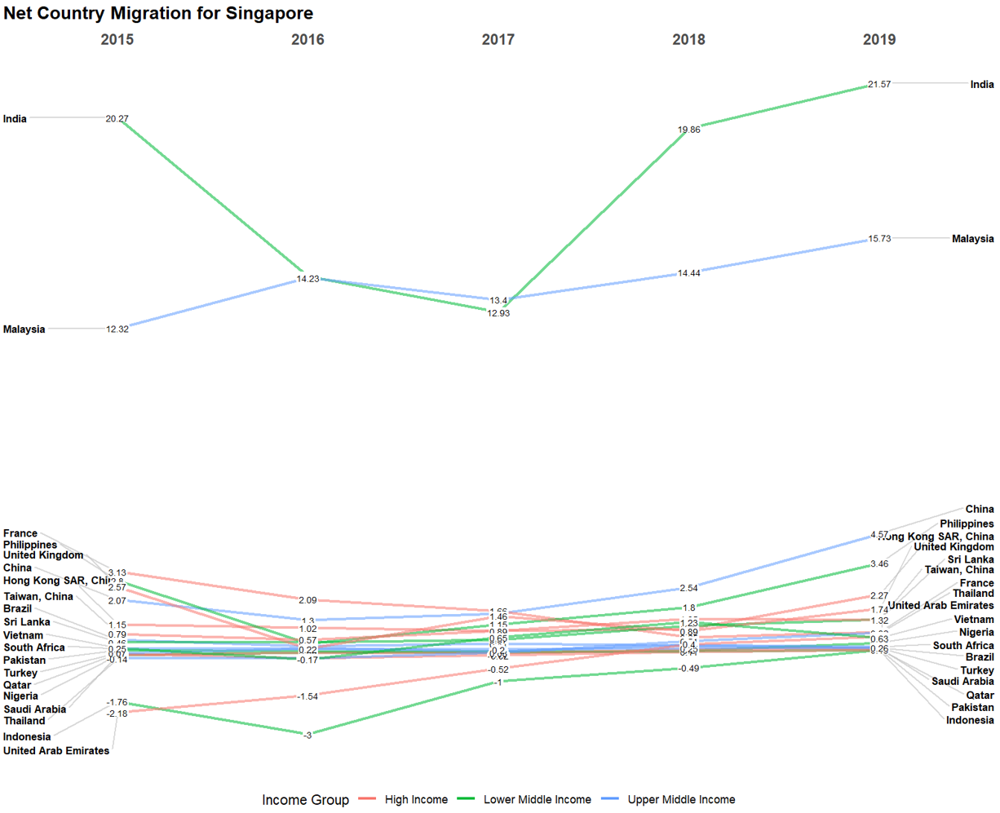

```{r, include=FALSE}
knitr::opts_chunk$set(echo = FALSE,
                      warning = FALSE,
                      tidy = FALSE,
                      message = FALSE,
                      fig.align = 'center',
                      out.width = "100%",
                      dpi=300)
options(knitr.table.format = "html") 
```

```{r, include=FALSE}
#knitr::write_bib(c('tidyverse', 'shiny', 'readxl', 'parameters', 'plotly', 'ggstatsplot', 'leaflet', 'treemap', 'd3treeR', 'geofacet', 'shinydashboard', 'shinydashboardPlus', 'shinyalert', 'dashboardthemes', 'shinyWidgets', 'shinyjs', 'shinycssloaders', 'shinyBS', 'ggallin', 'rmarkdown', 'posterdown', 'pagedown'), 'packages.bib')
```

# Introduction

The [LinkedIn and World Bank Group](https://linkedindata.worldbank.org/data) have partnered and released data from 2015 to 2019 that focuses on 100+ countries with at least 100,000 LinkedIn members each, distributed across 148 industries and 50,000 skill categories. This dataset aims to help government and researchers understand rapidly evolving labor markets with detailed and dynamic data. It comprises growth rate of employment in each industry in each industry, growth in number of people from each industry and skill in each country and top 10 skills required in each industry. As an extension, we included macroeconomic data ([GDP per capita](https://data.worldbank.org/indicator/NY.GDP.PCAP.CD)) and [population](https://data.worldbank.org/indicator/SP.POP.TOTL) data from the World Bank.

We have developed VISTAS (Visualising Industry Skill TAlent Shifts) - a dynamic, interactive and user-friendly visual analytics dashboard as a R Shiny application. Our application allows individuals and countries to view their competitive advantage and understand the evolving labour market across the world. Comparisons can be done at both country-level, industry-level and skill-level.

# Visualisations

Our application provides the user with two main modules to perform visual analytics. The first is the **Statistical Analysis** module, which provides the user with various sub-modules to compare different X and Y variables. The second is the **Migration Analysis** module, which provides the user with sub-modules to visualise country-country net talent migration, country-industry net migration and country-skill net migration.

## Statistical Analysis

### Regression Plot

The regression plot and histogram visualise the relationship between two variables (among GDP per capita growth, employment growth, industry migration or skill migration) and their marginal distributions.

```{r regression, echo=FALSE, fig.cap="Regression Plot Sub-module", out.width = '80%', out.extra='style="border: solid; border-colour: black;"'}

```

### Scatter Plot

The interactive scatter plot visualises the values for two variables (among GDP per capita growth, employment growth, industry migration or skill migration) and is coloured by year.

```{r scatter, echo=FALSE, fig.cap="Scatter Plot Sub-module", out.width = '80%', out.extra='style="border: solid; border-colour: black;"'}

```

### Correlation Matrix

The correlation matrix visualises the strength of relationship between pairs of variables. Four variables are used i.e. GDP per capita growth, employment growth, industry migration and skill migration.

```{r correlation, echo=FALSE, fig.cap="Correlation Matrix Sub-module", out.width = '80%', out.extra='style="border: solid; border-colour: black;"'}

```

## Migration Analysis

### Choropleth Map

The choropleth visualisation is a thematic map where countries are coloured by country, industry or skill migration values.

```{r choropleth, echo=FALSE, fig.cap="Choropleth Map Sub-module", out.width = '80%', out.extra='style="border: solid; border-colour: black;"'}

```

### Chord Diagram

The chord diagram is a graphical method of displaying the inter-relationships between data in a matrix. The data are arranged radially around a circle with the relationships between the data points drawn as arcs connecting the data. In this case, the relationship is the net migration between two countries.

```{r chorddiagram, echo=FALSE, fig.cap="Chord Diagram Sub-module", out.width = '80%', out.extra='style="border: solid; border-colour: black;"'}

```

### Slope Graph

The slope graph allows users to compare changes usually over time for a list of categorical variables. The change in country, industry or skill migration for various countries over the years are shown.

```{r slope, echo=FALSE, fig.cap="Slope Graph Sub-module", out.width = '80%', out.extra='style="border: solid; border-colour: black;"'}

```

### Treemap

The treemap displays hierarchical data as a set of nested rectangles. Each group is represented by a rectangle, which area is proportional to its value. It shows the net country, industry or skill migration by the colour of the rectangles, and either the population or GDP per Capita by the size of the rectangles. The rectangles can be nested by region or income group of the countries, and clicking on a rectangle will show the individual countries within that rectangle.

```{r treemap, echo=FALSE, fig.cap="Tree Map Sub-module", out.width = '80%', out.extra='style="border: solid; border-colour: black;"'}

```

### Geofacet

The geofacet plot takes data representing different geographic entities and apply a visualisation method to the data for each entity, with the resulting set of visualisations being laid out in a grid that mimics the original geographic topology as closely as possible. It shows the net country, industry or skill migration. If it is based on industry or skill migration and multiple industries or skills are selected, bar charts will be shown for each country.

```{r geofacet, echo=FALSE, fig.cap="Geofacet Sub-module", out.width = '80%', out.extra='style="border: solid; border-colour: black;"'}

```

# R Packages

Our application was centered around the tidyverse universe of packages and shiny. The **tidyverse** universe of packages includes ggplot2, which was the base package used for most of the plotting of graphs. It also includes other packages which were useful for data wrangling and manipulation. **shiny** was used as an easy way to create an interactive web application.

```{r, echo=FALSE,out.width="28%", out.height="28%",fig.cap="Tidyverse and shiny",fig.show='hold',fig.align='center'}
knitr::include_graphics(c("images/tidyverse-logo.png","images/shiny-logo.png"))
```

Other main packages: `readxl`, `parameters`, `plotly`, `ggstatsplot`, `leaflet`, `chorddiag`, `CGPfunctions`[^1], `treemap`, `d3treeR`[^2], `geofacet`

[^1]: The newggslopegraph function was modified to allow colour by groups

[^2]: d3treeR was modified to allow compatibility between packages of different d3.js versions

Extra bells and whistles: `shinydashboard`, `shinydashboardPlus`, `dashboardthemes`, `shinyWidgets`, `shinyjs`, `shinycssloaders`, `shinyBS`, `shinyalert`, `ggallin`

# Insights for Case Study

Using the VISTAS application, we will have a case study in 2019 on countries in East Asia and Pacific, in particular Singapore. The focus will be on the Information Technology and Services industry and Data Science skill, as it is of interest to SMU MITB students.

### Insight 1 - Higher Net Migration Per 10k LinkedIn Users from India and Malaysia to Singapore

Using Singapore as the base country and setting 4 bins for the Choropleth Map (Figure \@ref(fig:insight-1-choropleth)), we observe that there is higher net migration per 10k LinkedIn users from India (21.57) and Malaysia (15.73), as compared to other countries. This is similarly seen in the Slope Graph (Figure \@ref(fig:insight-1-slope)), where India and Malaysia consistently contribute higher net migration (top 2) from 2015 to 2019. Using the Chord Diagram (Figure \@ref(fig:insight-1-chord)), we can also see that there is higher net migration from Malaysia than other countries in East Asia and Pacific.

```{r insight-1-choropleth, echo=FALSE, fig.cap="Choropleth for Insight 1", out.width = '80%', out.extra='style="border: solid; border-colour: black;"'}

```

```{r insight-1-slope, echo=FALSE, fig.cap="Slope Graph for Insight 1", out.width = '80%', out.extra='style="border: solid; border-colour: black;"'}

```

```{r insight-1-chord, echo=FALSE, fig.cap="Chord Diagram for Insight 1", out.width = '80%', out.extra='style="border: solid; border-colour: black;"'}
knitr::include_graphics("images/Picture5.png")
```

### Insight 2 - Higher Net Migration Per 10k LinkedIn Users for Singapore and Australia in Information Technology and Services Industry and for Data Science Skill

Within the Information Technology and Services industry, we observe from the Slope Graph (Figure \@ref(fig:insight-2-slope)) that Singapore (365.47) and Australia (415.2) are among the top 20 in terms of net industry migration per 10k LinkedIn users. Similarly, the Geofacet Plot (Figure \@ref(fig:insight-2-geofacet)) and Treemap (Figure \@ref(fig:insight-2-treemap)) show Singapore and Australia to be among the top within East Asia and Pacific. In addition, we can size the countries on the Treemap by GDP per capita and observe that countries with higher GDP per capita tend to have higher net migration for the Information Technology and Services industry.

```{r insight-2-slope, echo=FALSE, fig.cap="Slope Graph for Insight 2", out.width = '80%', out.extra='style="border: solid; border-colour: black;"'}

```

```{r insight-2-geofacet, echo=FALSE, fig.cap="Geofacet Plot for Insight 2", out.width = '80%', out.extra='style="border: solid; border-colour: black;"'}

```

```{r insight-2-treemap, echo=FALSE, fig.cap="Treemap for Insight 2", out.width = '80%', out.extra='style="border: solid; border-colour: black;"'}

```

### Insight 3 - Strong Relationship Between Employment Growth and Industry Migration in Singapore for Information Technology and Services Industry

Lastly, using statistical analysis, we observe a strong correlation (0.91) between employment growth and industry migration in 2019 in Singapore for the Information Technology and Services industry (Figure \@ref(fig:insight-3-correlation)). The R-squared value (0.82) for the corresponding regression plot is also high (Figure \@ref(fig:insight-3-regression)), which shows a strong relationship. This can give an indication of how employment growth moves with industry migration for the information technology and services industry in Singapore and how likely job seekers can find a job.

```{r insight-3-correlation, echo=FALSE, fig.cap="Correlation Matrix for Insight 3", out.width = '80%', out.extra='style="border: solid; border-colour: black;"'}

```

```{r insight-3-regression, echo=FALSE, fig.cap="Regression Plot for Insight 3", out.width = '80%', out.extra='style="border: solid; border-colour: black;"'}

```

# Limitations and Future Work

We have identified the following limitations due to the dataset used:

1. Not all countries are captured due to the penetration rate of LinkedIn

2. The data is not representative of the entire migration landscape as LinkedIn data has better coverage for white-collar workers in knowledge-intensive sectors

3. The migration data only represents net migration and is unable to show us the inflow and outflow individually

We have identified the following opportunities for future work:

1. To augment our data with more indicators for the countries

2. To include cluster analysis to identify clusters of countries based on the various variables

# Conclusion

Through our application, we aim to provide users a user-friendly way to visualise data and perform visual analytics. Our application should be relatively easy to be used by the lay person that has next-to-zero knowledge of data analytics.

# Acknowledgement

We would like to thank Professor Kam Tin Seong for his guidance throughout the tenure of the project.

# Project Links

Our application can be assessed at https://moomookau.shinyapps.io/VISTAS/.

Code for the application and all documents can be found at https://github.com/moomookau/VISTAS/.
