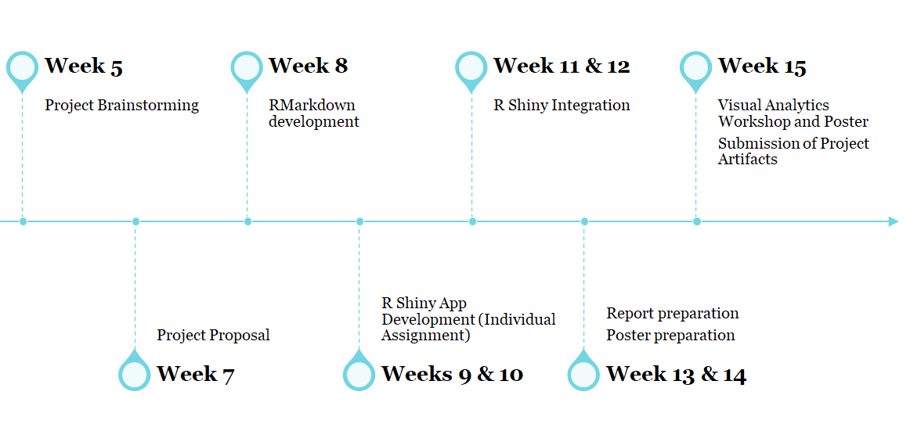

# 1. Background

The LinkedIn and World Bank Group have partnered and released data from 2015 to 2019 that focuses on 100+ countries with at least 100,000 LinkedIn members each, distributed across 148 industries and 50,000 skill categories. This data aims to help government and researchers understand rapidly evolving labor markets with detailed and dynamic data (The World Bank Group, 2021).

Simple data visualisations are also publicly available at <https://linkedindata.worldbank.org/data>. However, they are limited in the exploration of trends because they only allow one parameter of choice.

# 2. Project Motivation

Through our project, we want to provide individuals and countries with insights into various interest areas to benchmark themselves against the global landscape. As an extension, we will be including macroeconomic indicators of GDP growth from World Bank Organization to our data visualisations. We envision our project to help answer the following questions:

**For individuals:**

-   **Increasing employability** - What are the highly sought-after skills to build up to increase employability in a particular country or a particular sector?

-   **Employment opportunities** - Which country holds better employment opportunities for certain skills or certain industry?

-   **Migration Trends** - Which country are people e.g. fellow countrymen, migrating to?

**For countries:**

-   **Migration Trends** - Where are our (country's) talent migrating to?

-   **Skill Trends** - What are the skills lost or gained in our country or in the sectors in our country?

-   **Learning from other countries** - Which skills (i.e. top skill needs in each industry) do we encourage and train in our own people to increase the competitiveness of our labour market against other countries?

-   **Skill and Industry Trends** - Are we losing or gaining the skills or industries we desire and according to plan? How do we change this, if required? 

Our final deliverable is to create a user-friendly, interactive dashboard that allows individuals and countries view their competitive advantage and understand evolving labour markets across the world in four areas: skills, occupations, migration and industries. Comparison will be allowed at both the country-level and industry-level.

# 3. Limitations of our Project

We have identified two main limitations of our project which arise due to the LinkedIn dataset:

-   Our data does not capture all the countries due to the penetration rate of LinkedIn; some countries do not use LinkedIn.

-   Our data is not representative of the entire migration landscape as LinkedIn data has better coverage fo white-collar workers in knowledge-intensive sectors.

# 4. Data Description

Our proposed datasets for analyses will come mainly from the LinkedIn-World Bank partnership. We will complement it with other macroeconomic indicators such as GDP per capita from World Bank as well:

-   <https://linkedindata.worldbank.org/>

-   <https://data.worldbank.org/indicator/NY.GDP.PCAP.CD>

The LinkedIn-World Bank dataset comprises the following:

-   ***Industry Employment Growth***: Growth rate of employment in each industry in each country from 2015-2019

    -   78 distinct industries

-   ***Talent Migration***: Growth in number of people with each skill in each country from 2015-2019

-   ***Industry Skills Need***: Top 10 skills required in each industry from 2015-2019

-   ***Skills Penetration***: Penetration of each skill in each industry from 2015-2019

The **GDP per capita** dataset comprises annual time-series GDP per capita (current USD) for countries.

# 5. Proposed Visualisations

The following sections list down some questions that we hope our application will be able to help answer. We propose various visualisation techniques to help the user visualise the information in a user-friendly way.

## 5.1 What are the desired skills required for each industry in each year?

## 5.2 Talent Migration: Which countries, industries and skills are gained and lost from 2015-2019?

## **5.3 Employment Growth vs Industry Migration (or Skill- Top 10 in industry)**

## 5.4 Is there any correlation between industry employment growth and GDP growth?

## 5.5 Which countries are similar to each other in terms of skills or growth?

# 6. Project Timeline

The following is the proposed project timeline:

# 7. Software Tools & R Packages

Our project will be done as an R Shiny application using RStudio as the IDE. We envision the use of the following packages:

-   R Shiny -- For creating an interactive R Shiny web-based application

-   Tidyverse -- The tidyverse collection of apps will provide the foundational packages for our project. Some core uses of this collection will be for plotting (ggplot2), data cleaning and manipulation (dplyr, tidyr).

-   networkD3 - For plotting sankey diagrams

-   circlize - For plotting chord diagrams

# 8. Github Repository

The code for our project can be found at <https://github.com/moomookau/VISTAS>.

# 9. Team Members

1.  [Amos Lau](https://va.moomookau.org)
2.  [Cheryl Pay](https://cherylpay-isss608.netlify.app)
3.  [Louis Chong](https://affectionate-dijkstra-f71bd4.netlify.app)

# 10. References

1.  Duca, D. (2019, July 9). Using LinkedIn for social research. Retrieved February 28, 2021, from <https://blogs.lse.ac.uk/impactofsocialsciences/2019/07/09/using-linkedin-for-social-research/>

2.  World talent migration trends. (2019, August 22). Retrieved February 28, 2021, from <https://www.bayut.com/mybayut/world-talent-migration-trends/>

3.  *People on the move: Global migration's impact and opportunity* (2016, December). Retrieved February 28, 2021, from McKinsey Global Institute website: <https://www.mckinsey.com/~/media/McKinsey/Industries/Public%20and%20Social%20Sector/Our%20Insights/Global%20migrations%20impact%20and%20opportunity/MGI-People-on-the-Move-Full-report.pdf>
