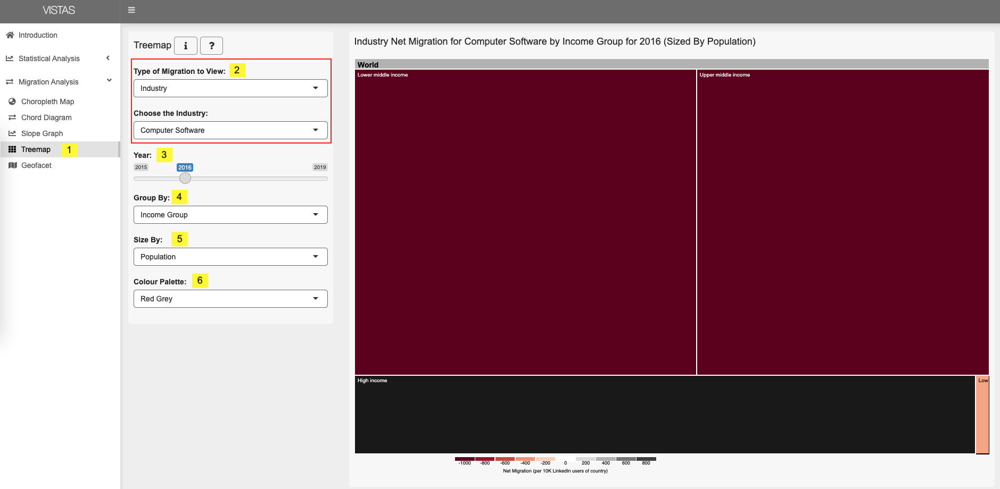
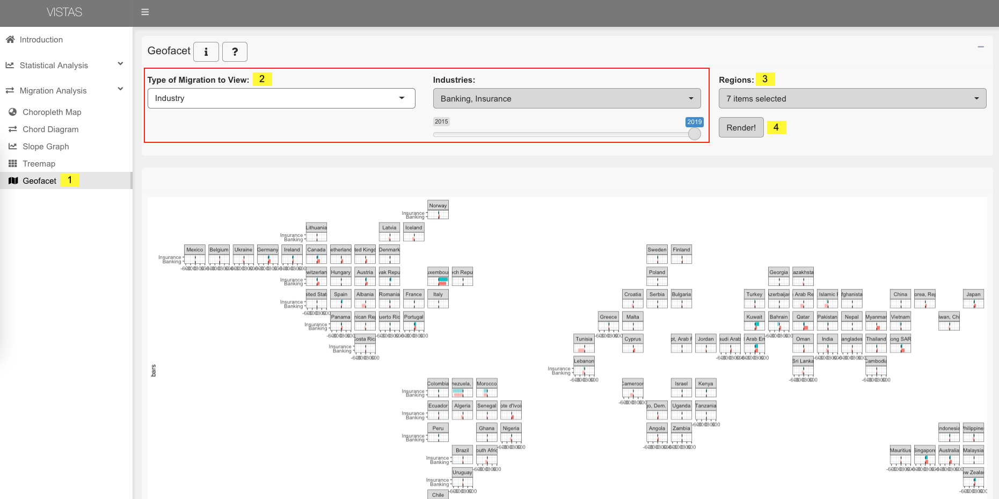
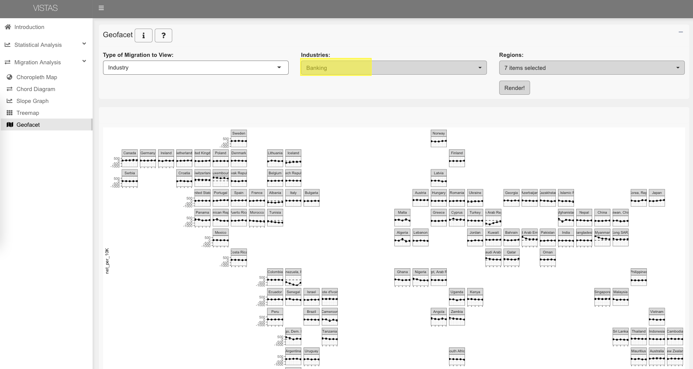
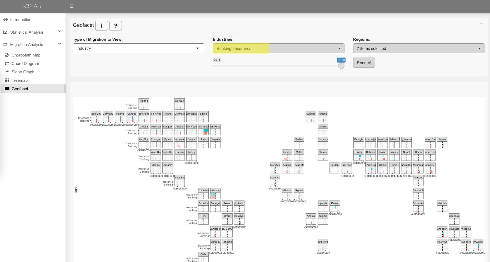

```{r setup, include=FALSE}
knitr::opts_chunk$set(echo = TRUE)
```

## User Guide for VISTAS (Visualising Industry Skill TAlent Shifts)

### 1. Introduction Page

On this page, there is a description of the application and cards that link to the various visualisation tabs.

{width="100%"}

When you hover over a card, the card flips to show a description and link to the visualisation. Below, the card for the choropleth map is flipped.


On the side panel, a tooltip also appears when you hover over each sub-tabs. Below, the tooltip for scatter plot is shown when you move your cursor to Scatter Plot.


Across each tab, there are two help buttons and many tooltips.


1.  When the **i** button is clicked, a description of the visualisation will pop up.

    {width="80%"}

2.  When the **?** button is clicked, a guide on selecting the inputs for the visualisation will pop up.

    {width="80%"}

3.  Spinning wheels are added to signify that the visualisations are being generated.

    {width="80%"}

4.  When you hover over the input labels, a tooltip will appear to describe its significance.

    {width="80%"}

### 2. Statistical Analysis

This tab has three sub-tabs for regression, scatter plot and correlation matrix. Each sub-tab has their own set of user inputs available.

#### 2.1 Regression

{width="100%"}

1.  Click on Regression in the navigation bar.

2.  Select the variable to plot on the y axis e.g. Employment Growth.

3.  Select the variable to plot on the x axis e.g. Industry Migration.

4.  Select filters to be applied on the dataset. The filters include year, country, region, income level, industry section and skill group.

    By default, all options are selected for each filter. On each filter, there are buttons to select all, deselect all or select individual options. Selected options will have a tick next to it.

5.  If the selected filters produce no data point, '0 rows selected' will be reflected and you will not be able to apply changes to generate the visualisation. Amend your filters to ensure results.

6.  Click on 'Apply changes' to generate the Regression Plot.

    *The spinning wheel indicates that the correlation matrix is being generated.* Once completed, the visualisation will be shown.

#### 2.2 Scatterplot


1.  Click on Scatter Plot in the navigation bar.

2.  Select the variable to plot on the y axis e.g. Employment Growth.

3.  Select the variable to plot on the x axis e.g. Industry Migration.

4.  Select filters to be applied on the dataset. The filters include year, country, region, income level, industry section and skill group.

    By default, all options are selected for each filter. On each filter, there are buttons to select all, deselect all or select individual options. Selected options will have a tick next to it.

5.  If the selected filters produce no data point, '0 rows selected' will be reflected and you will not be able to apply changes to generate the visualisation. Select the appropriate filters to ensure results.

6.  Once the variables and filters are selected, click on 'Apply changes'.

7.  Hover over each point on the interactive scatter plot to find out its values i.e. x variable, y variable, year, country, industry and skill.

8.  There are buttons on the interactive scatter plot to carry out actions e.g. download plot as png, zoom, select.

    *The spinning wheel indicates that the correlation matrix is being generated.* Once completed, the visualisation will be shown.

#### 2.3 Correlation Matrix


1.  Click on Correlation Matrix in the navigation bar.

2.  Four variables are used for the correlation matrix i.e. GDP per capita growth, Employment growth, Industry migration and Skill migration.

3.  Select filters to be applied on the dataset. The filters include year, country, region, income level, industry section and skill group.

    By default, all options are selected for each filter. On each filter, there are buttons to select all, deselect all or select individual options. Selected options will have a tick next to it.

4.  If the selected filters produce no data point, '0 rows selected' will be reflected and you will not be able to apply changes to generate the visualisation. Select the appropriate filters to ensure results.

5.  Once the variables and filters are selected, click on 'Apply changes'.

    *The spinning wheel indicates that the correlation matrix is being generated.* Once completed, the visualisation will be shown.

### 3. Migration Analysis

#### 3.1 Choropleth Map


1.  Click on Choropleth Map in the navigation bar.

2.  Select Type of Migration to View from the dropdown -- Country, Industry or Skill.

    -   When Country is selected, you must further select Base Country i.e. the country you want to see the net migration for. The dropdown list is sorted by Region then alphabetical order.

    -   When Industry is selected, you must further select the Industries you want to see the net migration for.

    -   When Skills is selected, you must further select the Skills you want to see the net migration for.

3.  Select Year on the slider as the data covers years 2015 -- 2019 (both years included).

4.  Select Colour by from the dropdown. This variable determines the shades you see on the map.

    -   When Bins is selected, you can further indicate the number of bins.

    -   When Quantile is selected, you can further indicate the number of quantiles.

    -   When Numeric is selected, no further options are available.

5.  Select Colour Palette to watch the colours of the choropleth map change.

#### 3.2 Chord Diagram


1.  Click on the Chord Diagram in the navigation bar.
2.  Select at least three countries from the dropdown list for Countries.
3.  Select Year on the slider as the data covers years 2015 -- 2019 (both years included).
4.  Select Order by Income Group or Region.
5.  Select Migration Perspective inwards or outwards.

#### 3.3 Slope Graph


1.  Click on Slope Graph in the navigation bar.

2.  Select Type of Migration to View from the dropdown -- Country, Industry or Skill.

    -   When Country is selected, you must further select Base Country i.e. the country you want to see the net migration for. The dropdown list is sorted by Region then alphabetical order.

    -   When Industry is selected, you must further select the Industries you want to see the net migration for.

    -   When Skills is selected, you must further select the Skills you want to see the net migration for.

3.  Select Top, Bottom or Top and Bottom.

    -   When "Top and Bottom" is selected, both the top and bottom ranked countries are shown.

4.  Indicate the number of countries (N) you want to see on your slope graph.

5.  Select Colour by Region or Income Group. This variable determines the colors of the lines on the slope graph.

6.  Check Pseudolog Y-Axis to transform the y-axis. Pseudolog allows for a log-like transformation for both negative and positive values on the slope graph; visually, this feature results in lines on the slope graph being less cluttered.

#### 3.4 Treemap



1.  Click on Treemap in the navigation bar.

2.  Select Type of Migration to View from the dropdown -- Country, Industry or Skill.

    -   When Country is selected, you must further select Base Country i.e. the country you want to see the net migration for. The dropdown list is sorted by Region then alphabetical order.

    -   When Industry is selected, you must further select the Industries you want to see the net migration for.

    -   When Skills is selected, you must further select the Skills you want to see the net migration for.

3.  Select Year on the slider as the data covers years 2015 -- 2019 (both years included).

4.  Select Group by Region or Income Group to see the hierarchy in the treemap. Click on the rectangles to go down a level in the hierarchy, click on the top header to go up a level in the hierarchy.

5.  Select Size By Population or GDP Per Capita. This determines the size of the rectangles in the treemap.

6.  Select Colour Palette to watch the colours of the choropleth map change.

#### 3.5 Geofacet

The geofacet has two types of visualisations, line graph and bar graphs. These graphs are shown based on the user inputs.

{width="100%"}

1.  Click on Geofacet in the navigation bar.

2.  Select Type of Migration to View from the dropdown -- Country, Industry or Skill.

    -   When Country is selected, you must further select Base Country i.e. the country you want to see the net migration for. The dropdown list is sorted by Region then alphabetical order.
    -   When Industry is selected, you must further select the Industries you want to see the net migration for.
    -   When Skills is selected, you must further select the Skills you want to see the net migration for.

    If one country, industry or skill is selected, a line chart will show the migration trend over the years.

    {width="80%"}

    If more than one country, industry or skills are selected, the bar chart will display the migration for them for a selected year.

    {width="80%"}

3.  Select the Region(s) you would like to see geofacets for. The select region(s) will show on the visualization.

4.  Once you have selected the above, click on "Render!". The spinning wheel indicates that the geofacets are loading. Once completed, the visualization will show.

5.  To reset your selections for Industry migration and Skills migration, go to Type of Migration to View, select country, then the industries and skills that you've selected will reset. Then repeat Steps 2-4 again.
